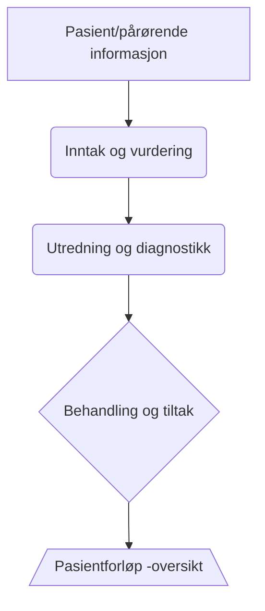

---
# Title, summary, and page position.
linktitle: OCD
summary: Tvangslidelse
weight: 1
icon: book
icon_pack: fas

# Page metadata.
title: OCD
date: "2018-09-09T00:00:00Z"
type: book  # Do not modify.
diagram: true
---

## Tvangslidelse/OCD

Pasientforløpet beskriver forventet pasientforløp for pasienter med OCD. Formålet
med pasientforløpet er å skape sammenheng i tjenestene, samt oppnå bedre kvalitet
og øke mulighet for brukermedvirkning

